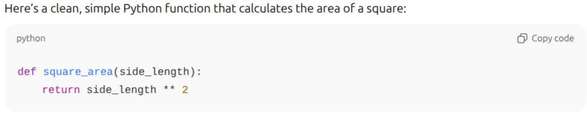
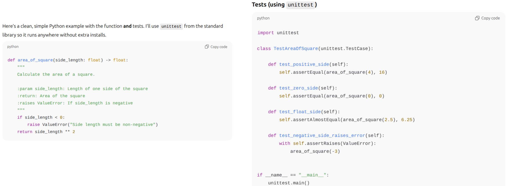
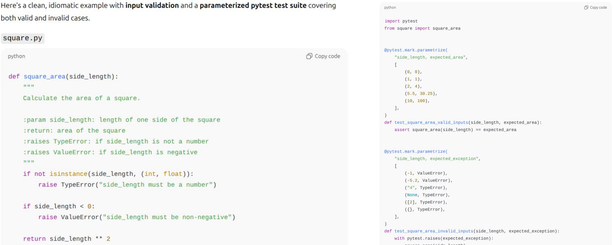

<!-- _class: title -->
<!-- _paginate: false -->
<!-- _footer: "ssciwr.github.io/python-testing-intro &nbsp;&nbsp; 2026.02.09" -->

# Introduction to Python Testing

## Liam Keegan, SSC

---

# Course Outline

- Testing
  - What is automated testing
  - Benefits of a good test suite
  - Different types of tests
- Hands on with pytest
  - Install and run pytest
  - Write simple tests
  - Use temporary files in tests
  - Use fixtures to manage resources
  - Parameterized tests
  - Write tests in a Jupyter notebook
- Best practices
  - How to write good tests

---

<!-- _class: subtitle -->

# Testing

---

# What is testing anyway?

There are many ways in which all software is tested:

- It is "tested" every time it is used and produces some output
- It was probably manually tested with some sample inputs when written
- There is probably some manual testing when changes are made

However this kind of "testing" can quickly become both insufficient and inefficient as a software project grows in complexity.

Changing the code risks breaking things that previously worked without notice, and manually testing all the functionality quickly becomes an impossible task

---

# Automated tests

Many software projects also have automated tests

- A test is a piece of code that tests some behaviour of the software
- A test suite is a collection of such tests
- The test suite typically runs automatically whenever a change is made
- The more complex the project, the more value a good test suite provides
- But a test suite is not only for large projects!

This is the kind of testing we will learn about in this course.

---

# Types of tests

- Unit tests
- Integration tests
- System tests
- Regression tests
- Approval tests
- Acceptance tests
- Smoke tests
- Performance tests
- Fuzzing tests
- Property based tests
- ...

---

# Types of tests

- **Unit tests**
- **Integration tests**
- System tests
- Regression tests
- Approval tests
- Acceptance tests
- Smoke tests
- Performance tests
- Fuzzing tests
- Property based tests
- ...

---

# Unit tests

- Small, self-contained tests of a piece of functionality
- Narrow scope: eg. a single function or class
- Fast to run
- Don't depend on any other components
  - Dependencies sometimes replaced with mocks or doubles
- Typically most (e.g. 80%) of your tests should be unit tests
- Primary way of testing correctness
- Should be written alongside the functionality being tested
- Failing unit test directly tells you what has gone wrong

---

# Integration / System tests

- Also known as "end-to-end" or "functional" tests
- Tests involving multiple interacting components
- Should be a smaller fraction (e.g. 20%) of your test suite
- Compared to unit tests
  - Typically take longer to run
  - Typically more risks of being brittle or flaky
  - Typically need more maintenance
- If most tests end up as integration tests, consider making code more modular

There are other kinds of tests, but a great test suite can be built from only unit and integration tests.

---

# A good test suite provides many benefits

- Ensure **correctness** of your code when you write it
- **Maintain** correctness of your code as things change around it
- Make changes or **refactor** code without fear
- Find bugs **earlier** and more easily
- Easier for new contributors to make **positive** changes
- Complements the **documentation** as examples of use
- Gives others **confidence** in the correctness of your code
- Encourages **well-designed** modular code and interfaces

---

# The pytest library

- You don't need to use a library to write a test suite
- But it makes your life much easier

In this course we'll use pytest to help us create our tests

- pytest is a very widely used Python test framework
- Makes it easy to write small and readable tests
- Also offers more advanced features such as fixtures and mocks
- Large ecosystem of plugins providing additional functionality
- Well documented: [docs.pytest.org](https://docs.pytest.org)

---

<!-- _class: subtitle -->

# Hands on with pytest

---

# Hands on coding

- For each topic we'll look at a couple of introductory slides
- Then we'll write some code and tests together
- You can see all the code as I write it here:

  **https://github.com/ssciwr/python-testing-intro-live**

- You will need
  - A Python environment where you can install packages, e.g.
    - https://mamba.readthedocs.io/en/latest/installation/micromamba-installation.html
  - An editor to write your code and tests, e.g.
    - https://www.jetbrains.com/pycharm/download
    - https://code.visualstudio.com

---

# Conda environment

- First we'll create a new conda environment called "testing"

  ```
  conda create -n testing
  ```

- Then we'll activate this environment

  ```
  conda activate testing
  ```

- Now we can install python and pytest into our environment:

  ```
  conda install python pytest -c conda-forge
  ```

Note: if you are using micromamba then replace the `conda` command above with `micromamba`

---

# Pytest use in one slide

1. For every file `x.py`, add a file `test_x.py`

2. In this file, write functions with names that start with `test_`

3. Inside these functions, `assert` things about the code in `x.py`

4. Run pytest: `python -m pytest`

5. You now have an automated test suite!

---

<!-- _class: hands-on -->

# Coding #1

- Write a function that calculates the area of a square

- Write some tests for it

- Run the tests

- Experiment with tests that fail, tests that pass

- What happens if we add a test for a square with length 0.2?

---

# Pytest float equality

- Testing if two Integers are the same is easy:
  - `assert a == b`
- Floats are less trivial, because on a computer they have finite precision
  - Best to assert that they are approximately equal
  - But should we use the relative or absolute difference?
  - And how close should they be?
- Use the `approx` function for a sensible floating point equality test

```python
def test_floats_equal():
    assert 0.999999999999 == pytest.approx(1.0)
```

---

<!-- _class: hands-on -->

# Coding #2

- Use pytest.approx to write robust tests for floats

- What happens if we pass a negative number for the length?

- What should happen?

- Update our function to raise a ValueError exception for negative inputs

- How can we test this?

---

# Pytest exceptions

- How do we assert that code should raise an exception?
- Use the `pytest.raises` context manager

```python
import pytest

def test_exception():
    my_list = [1, 2, 3]
    with pytest.raises(IndexError):
        my_list[5]
```

---

<!-- _class: hands-on -->

# Coding #3

- Use `pytest.raises` to test negative inputs

- Should we check for Exception or ValueError?

- Can we check what the error message was as well as the exception type?

- Can we do multiple exception-causing things inside pytest.raises?

- What happens if we pass a string or a list instead of a number for length?

---

# Pytest parameterize tests

- How do we repeat a test with different inputs?
- Use the `@pytest.mark.parameterize` decorator

```python
@pytest.mark.parametrize("length", [-2, -5.67])
def test_area_of_square_invalid_value(length):
    with pytest.raises(ValueError):
        area_of_square(length)
```

---

<!-- _class: hands-on -->

# Coding #4

- Use `pytest.mark.parameterize` to repeat a test for different inputs

- Rewrite our existing tests using this feature

- Extend our code to also deal with rectangles (i.e. width and length inputs)

- Write a rectangle test that is parametrized over both of these inputs

- Refactor our `area_of_square` code to call `area_of_rectangle`

---

# Pytest command line arguments

- `-s`
  - Show console output from code
- `-v`
  - Verbose: list all tests that are ran
- `-x`
  - Stop early if a test fails
- `-k`
  - Only run matching tests
- `-h`
  - Display information about command line arguments

---

<!-- _class: hands-on -->

# Coding #5

- Use command line arguments to control pytest

- Select particular tests to run or to exclude

- Stop the tests when one test fails

- Display more information about the tests

- Display any console output from the code

---

# Pytest temporary files

- How do we create a temporary folder for a test?
- Use the `tmp_path` fixture

```python
def test_write(tmp_path):
    print(tmp_path)
    assert str(tmp_path) != ""
```

---

<!-- _class: hands-on -->

# Coding #6

- Create a function that counts the number of lines in a text file

- Write a test for this function using tmp_path to make a temporary input file

---

# Pytest fixtures

- How do we inherit or reuse context, data and mocks?
- Create and use `fixtures`
- Fixtures can themselves use other fixtures

```python
@pytest.fixture()
def colors():
    return ["red", "green", "blue"]

def test_colors(colors):
    assert colors[0] == "red"
    assert len(colors) == 3
```

---

<!-- _class: hands-on -->

# Coding #7

- Create a pytest.fixture that returns a temporary file

- Refactor the test to use this fixture

- Add a function to count the characters in the file

- Use this fixture to write a test for the new function

---

# Pytest mocking

- How do we mock an attribute or environment variable?
- Use the `monkeypatch` fixture

```python
def test_message_box(monkeypatch):

    def do_nothing(*args, **kwargs):
        return

    monkeypatch.setattr(QMessageBox, "information", do_nothing)
    QMessageBox.information(None, "title", "text")
```

---

# Conda environment

- For the next part we'll use the requests library to download files

- To install it using conda

  ```
  conda install requests -c conda-forge
  ```

- Or alternatively install it using pip

  ```
  pip install requests
  ```

---

<!-- _class: hands-on -->

# Coding #8

- Write a function that returns the number of bytes of a download url

- Use the requests library to download the file

- Write a test of this function

- To be robust we don't want the test to actually download a file

- We can monkeypatch requests.get to instead return a test file

---

# Jupyter notebook

- What about code in jupyter notebooks?
- The [ipytest](https://github.com/chmp/ipytest) package lets us run pytest tests inside the notebook:
  - `import ipytest`
  - `ipytest.autoconfig()`
- Write your pytest test case inside a notebook cell
- Add this command to the first line of the cell:
  - `%%ipytest`
- Executing the cell will run pytest & display the output below the cell

A big advantage of this over just manually running code in a cell to test things is that if you later transfer this code into a python module or package you can also transfer the tests.

---

# Conda environment

- Ensure that jupyter lab and ipytest are installed

  ```
  conda install jupyterlab ipytest -c conda-forge
  ```

- Or alternatively install it using pip

  ```
  pip install jupyterlab ipytest
  ```

---

<!-- _class: hands-on -->

# Coding #9

- Create a jupyter notebook

- Import and initialize ipytest

- Write and run a test function

- Check what output you get when the test passes and fails

---

# Pytest fixture factories

- How do we make a fixture that can take arguments?
- Use a `fixture factory`

```python
@pytest.fixture
def named_tmp_file(tmp_path):
    def _callable(name):
        return tmp_path / name
    return _callable

def test_tmp_file(named_tmp_file):
    tmp_file = named_tmp_file("tempy.temp")
    assert tmp_file.name == "tempy.temp"
```

---

<!-- _class: hands-on -->

# Coding #10

- Create a pytest.fixture that returns a temporary file with n lines

- One way to do this is using a fixture factory

- The fixture doesn't return the temp file, but instead it returns a function

- Inside the test that function can be called to generate the file

---

<!-- _class: subtitle -->

# Best Practices

---

# Good tests are...

- Correct
  - They test that the thing they are testing is working
- Readable
  - It is obvious from looking at it what the test does
- Complete
  - They covers all relevant cases and behaviours
- Documentation
  - They demonstrate how the code being tested should be used
- Resilient
  - They only fail when the thing being tested is false, not for any other reason
- Unchanging
  - They don't need to be modified unless the behaviour being tested changes

---

# Mostly write unit tests


---

# Keep test code simple

- Test code should be "obvious upon inspection"
- Should be complete: contain enough information to understand the test
- Should be concise: don't include irrelevant information
- Avoid "clever" code, complex control flow, magic numbers, etc
- Some code repetition between tests is ok if it makes test code simpler

Why?

- There are no tests for your tests!
- When a test fails, reading the test code should tell you what is wrong

---

# Name tests well

- Test names should include the behaviour being tested
- Seeing the failing test name should already give a good idea what is broken
- It is fine if this makes the test name long
  - We're not **calling** this function in our code, it being long doesn't matter
  - We're **reading** its name in a failing test report, a human should understand its intent
- Some examples: bad short name -> better longer name
  - `test0` -> `test_divide_by_zero_raises_exception`
  - `test_auth` -> `test_invalid_user_should_deny_access`
  - `test_widget` -> `test_mouse_click_on_widget_changes_colour`
- Consider a sentence involving "should" as a starting point for the name
- Try to ensure consistency in test naming

---

# Don't test unrelated things

- Don't assert things unrelated to the thing you are testing
- Avoid assumptions about the internal structure of the code

Why?

- Avoid the test becoming brittle / noisy
  - Unrelated changes should not cause the test to fail
- Make the test more maintainable
  - Unrelated changes should not require the test to be updated
- Make the meaning of the test clear
  - Test failure should tell you what broke and what needs to be fixed

---

<!-- _class: subtitle -->

# Testing and AI

---

# Testing and AI

- Many people now use AI to help them write code
  - This could be via a chat interface, a command line tool, an IDE, or an agent
- Note that AI is really good at giving you what you ask for
  - Sometimes not so good at giving you what you need
- Don't forget to ask for tests as well as code!
  - This gives you a test suite basically for free
- TDD (test-driven-development) can also work well with AI
  - Describe the functionality to the AI
  - Then ask it to write only the tests for this functionality
  - You can then inspect the tests and confirm they are testing the behaviour you want
  - Finally ask it to write the implementation

---

# Chat example: code only

_"write a python function the calculates the area of a square"_



---

# Chat example: code + tests

_"write a python function the calculates the area of a square and include tests"_



---

# Chat example: code + good tests

_"write a python function the calculates the area of a square. include a parameterised pytest test suite that includes valid and invalid inputs"_



---

<!-- _class: subtitle -->

# Summary

---

# Summary

In this course we covered:

- Testing
  - What is automated testing
  - Benefits of a good test suite
  - Different types of tests
- Hands on with pytest
  - Install and run pytest
  - Write simple tests
  - Use temporary files in tests
  - Use fixtures to manage resources
  - Parametrize tests
  - Write tests in a Jupyter notebook
- Best practices
  - How to write good tests
  - Testing and AI

---

# Next steps

- Try adding some tests to your code
  - If in doubt the pytest documentation is excellent:
    - https://docs.pytest.org/
- For your next Python project
  - Try our basic template for Python research software development:
    - https://github.com/ssciwr/python-project-template
- For your next Python package
  - Try our cookiecutter to generate a Python package with pytest tests, CI, coverage, etc:
    - https://github.com/ssciwr/cookiecutter-python-package
- SSC compact course "Effective Software Testing"
  - https://ssciwr.github.io/effective-software-testing
